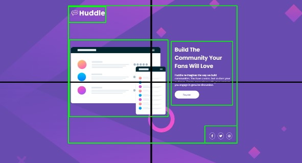

<h1 align="center">Landing Page - Huddle</h1>
<br>

<p align="center">1° Desafio do curso com Feedback</p> 
<br>

<div>
    <h3 align="center"><strong>Desktop View</strong><h3>
    <a href="https://thaleshng.github.io/quest-html-css-avancado/" target="_blank"></a> 
</div>

<div align="center">
    <h3 align="center"><strong>Mobile View</strong><h3>
    <a href="https://thaleshng.github.io/quest-html-css-avancado/" target="_blank"></a> 
</div>

<div align="center">
    
    
    <br>
    
    <br>
    
</div>

<br>


<div align="center">
    <a href="#tecnologias-utilizadas">Tecnologias Utilizadas</a> •
    <a href="#finalidade-do-projeto">Finalidade do Projeto</a> •
    <a href="#feedback">Feedback</a> •
    <a href="#dificuldades-encontradas-e-aprendizados">Dificuldades Encontradas e Aprendizados</a> •
    <a href="#como-ter-acesso-ao-código">Como ter acesso ao Código</a>
</div>

<br>
<br>

<h2 align="center">Tecnologias Utilizadas</h2>
<br>

[](https://www.devmedia.com.br/o-que-e-o-html5/25820)
<br>
<br>

[](https://kenzie.com.br/blog/css3/)
<br>
<br>
<br>
<br>

<h2 align="center">Finalidade do Projeto</h2>
<br>

<p> O projeto em questão tem como finalidade testar os aprendizados dos módulos de HTML e CSS do curso de developer.</p> 
<p>A premissa do desafio em questão foi avaliar como o aluno do curso faria uma Landing Page de uma Mídia Social Fictícia (Huddle), usando as ferramentas ensinadas no curso.
<p>Finalizado o projeto, os professores do curso dariam um feedback do código, para testar o nível de aprendizado de cada aluno e corrigir o código para que os alunos possam melhorar suas maneiras de codar.
</p> 
<br>
<br>
<br>
<br>

<h2 align="center">Feedback</h2>
<br>

<h3 align="center">"Correção de Quest:
HTML + CSS Avançado</h3>
<br>
<p align="center">Aluno: Thales Henrique - Turma 11<br>
<a href="https://github.com/thaleshng/quest-html-css-avancado">https://github.com/thaleshng/quest-html-css-avancado</a></p>

<h3>Requisitos Obrigatórios:</h3>
<ul>
    <li><s>O layout de desktop deve estar o mais fiel possível ao layout do exercício.</s></li>
    <li><s>O site deve funcionar em diferentes resoluções mantendo a fidelidade com o layout responsivo.</s></li>
    <li><s>Os usuários devem ser capazes de visualizar os estados de foco de todos os elementos interativos da página.</s></li>
</ul>

<h3>Projeto do Aluno:</h3>
<strong>[ 1920 x 1080 ] - Resolution</strong>

<h3>Pontuações:</h3>
<ol>
    <li>Nesse trecho de código, as suas duas tags de imagem foram devidamente preenchidas - seus atributos alt=”” estão preenchidos:
    
    Preencher esse atributo "alt" das tags "img" é uma prática importante para melhorar a acessibilidade, SEO, usabilidade e navegação em dispositivos móveis de uma página da web.</li><br>
    <li>Considerando que aqui é um espaço reservado apenas a itens muito semelhantes, poderia ter criado uma lista (ul) e preenchido ela com três itens (li):
    
    Poderia também ter envolvido tudo numa tag Nav pra aumentar a semântica da estrutura, algo como isso:
    
    <strong>OBS: Certifique-se de manter os itens da lista com <span style=color:#FF68FF;>tags âncora</span>, já que é uma lista de <span style=color:#6BA950>ícones</span> que levam o usuário para outras redes sociais.</strong></li><br>
    <li>Em <strong>resoluções maiores</strong> o seu conteúdo permanece muito bem alinhado horizontalmente, verticalmente e com todos os elementos proporcionalmente maiores:
    Ficou realmente muito bom, parabéns!</li><br>
    <li>Em <strong>resoluções menores</strong>, o seu conteúdo <strong>se adapta</strong> para ser bem renderizado:<br>
    <--->
    O resultado final deveria ficar o mais próximo possível com a imagem da direita.<br>
    Poderia apenas ter trocado o background pela imagem mobile, ela já está no seu projeto, se chama <strong>bg-mobile.svg</strong>, se não me engano.<br>
    Seria interessante ajustar o tamanho e posicionamento dos textos.</li><br>
    <li>Um dos desafios importantes dessa Quest era fazer com que o usuário pudesse visualizar os estados de foco nos elementos interativos da página - <strong>Botão de Registro + Ícones de Redes Sociais.</strong><br>
    Em seu projeto, os elementos <strong>estão semelhantes</strong> ao que foi pedido. Poderia, talvez, ajustar um pouco o tamanho e colocar uma sombra no botão de registro. Outro ponto que merece atenção são as bordinhas dos ícones, elas estão ovais e com cores muito fortes:<br>
     
    A solução deveria ficar o mais próxima possível desse resultado aqui:
    
    Só te confortando aqui porque se trata de um ajuste sutil, o qual não tem um impacto tão grande assim no resultado final. No entanto, como Dev Frontend/FullStack, se você se preocupar um pouco mais com aspectos estéticos minuciosos, lá na frente, com certeza você vai ser um profissional destaque no mercado.</li><br>
    <li>Gostei muito da separação de responsabilidades em diferentes arquivos CSS:<br>
    <br>
    É uma ótima prática e vai te garantir organização e coesão nos teus projetos.
    Ter separado as responsabilidades das estilizações colocando os estilos responsivos num único arquivo foi uma ótima ideia:
    </li>
</ol>
<br>
<p>No fim, completou o desafio de HTML + CSS Avançado, tá mandando bem!
Anota essas observações, se preferir, e vai treinando tudo isso. Usa essas mesmas observações nos próximos projetos que vão te ajudar bastante.
Como desafio final, tenta refatorar esse seu código usando essas dicas, com a prática você pega o jeito da coisa. 
</p>

<h3>~ Boa sorte, Thales! ☕"</h3>
<br>
<br>
<br>
<br>

<h2 align="center">Dificuldades Encontradas e Aprendizados</h2>
<br>

<p> A Principal dificuldade encontrada foi parecida com a dificuldade encontrada no projeto do Componente NFT feito anteriormente <a href="https://github.com/thaleshng/nft-component">(https://github.com/thaleshng/nft-component)</a>, visto que, era um desafio do Frontend Mentor e o valor dos espaçamentos dos elementos (margin e padding) não serem dados previamente, e por possuirem mais elementos que o projeto anterior citado acima, foi mais difícil 'descobrir' os valores desses espaçamentos, além de estar fazendo o projeto em um tela menor que a tela 'base' do design do projeto apresentado.</p>
<p> Foi usado o '<strong>PerfectPixel</strong>' e o '<strong>LightShot</strong>' para 'descobrir' os valores dos espaçamentos, porém, por conta da tela ser menor houve uma dificuldade maior de 'replicar' o projeto para outras dimensões de telas, sendo assim, necessitando no meu ponto de vista, fazer um arquivo maior de responsividade englobando essas outras dimensões de telas.
<p>Foram usadas tags mais semânticas no HTML melhorando o SEO (Search Engine Optimization), para aumentar as chances do site ser encontrado pelos usuários. <br>Além disso, as tags semânticas também ajudam na acessibilidade para que leitores de tela e outros dispositivos assistivos entendam melhor a estrutura do conteúdo.</p>
<p>Após receber o Feedback, busquei refatorar o código seguindo as pontuações que foram passadas no mesmo, acredito ter conseguido um bom resultado.</p>
<br>
<br>
<br>
<br>

<h2 align="center">Como ter acesso ao Código<h2>
<br>

### Pré-requisitos:
<br>
Antes de começar, vai precisar ter instalado na sua máquina as seguintes ferramentas:
<br>
<br>

[Git Bash](https://git-scm.com)

[VS Code](https://code.visualstudio.com)
<br>
<br>

Clone este repositório com o Git Bash:
```
git clone https://github.com/thaleshng/quest-html-css-avancado.git
```
Entra na pasta que foi criada e abra com o Visual Studio Code.